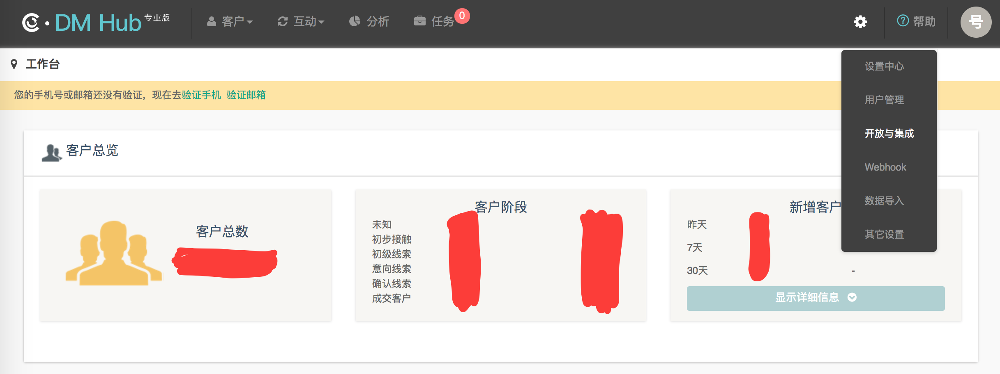
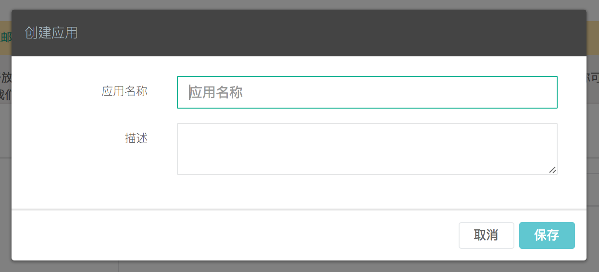
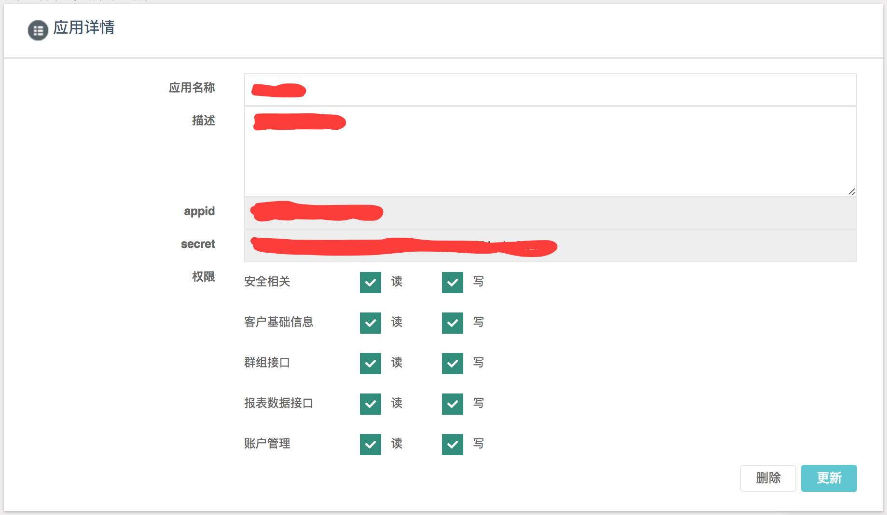

# Android SDK 开发指南
## 1. 创建应用
集成 DMHub SDK 之前，您首先需要到 DM Hub 平台创建应用。
### 1.1 进入应用设置页面
点击 DM Hub 平台首页右上角的齿轮图标，选择 `开放与集成` 选项，进入应用设置页面。


### 1.2 新建应用
在应用设置页面点击右上角的 `+ 新建` 按钮，在弹出的创建应用弹出框中填写应用名称和描述后保存。


### 1.3 更新权限设置
创建应用成功之后，即可获得集成 SDK 所需的 appid 和 secret 信息。根据开发需求进行权限设置后，点击右下角的 `更新` 按钮（注：即使没有更改权限设置，也要进行更新），完成应用创建。


## 2. 导入 SDK
DMHub Android SDK 要求 Android API >= 15。
### 2.1 复制 aar 包
复制 libs 目录下的 dmhubsdk-android-0.1.0.aar 文件到工程主 module 的 libs 目录下。
### 2.2 修改 gradle 配置
打开工程主 module 的 build.gradle 配置文件，添加配置：
```gradle
android {
    ......
}

repositories {
    flatDir {
        dirs 'libs'
    }
}

dependencies {
    ......
    compile(name: 'dmhubsdk-android-0.1.0', ext: 'aar')
    compile 'com.squareup.okhttp3:okhttp:3.0.1'
    ......
}
```
### 2.3 配置 AndroidManifest.xml
在 AndroidManifest.xml 中的 `<application></application>` 标签内配置 SDK 所需参数：
```xml
<meta-data
	android:name="DMHubSDKAppId"
	android:value="在 DM Hub 平台获得的 appid" />
<meta-data
	android:name="DMHubSDKSecret"
	android:value="在 DM Hub 平台获得的 secret" />
```
如果您是在测试账号下创建的应用，则需要添加配置：
```xml
<meta-data
	android:name="DMHubServer"
	android:value="http://api.convertwork.cn" />
```
## 3. 初始化
在自定义的 `Application` 中的 `onCreate` 方法中调用初始化方法：
```java
public class DMHubApp extends Application{
    
    @Override
    public void onCreate() {
        super.onCreate();

        // 初始化 DMHubSDK
        DMHubSDK.sharedInstance().init(this);
    }
}
```
注：在整个应用程序全局，只需要进行一次初始化。
## 4. 创建客户和客户身份
在客户首次打开应用时，以 `JPush Registration Id` 作为客户身份创建未知客户和客户身份：
```java
/**
 * @param dmHubAppName 在 DM Hub 平台创建应用时设置的应用名称
 * @param jPushAppKey  JPush 的 AppKey
 * @param jPushId      JPush SDK 向 JPush Server 注册所得到的注册 ID
 * @param source       显示在 DM Hub 客户时间轴上的客户来源，建议使用 App 名称
 */
DMHubSDK.sharedInstance().createUnknownCustomerWithJPushIdentity(
	dmHubAppName,
	jPushAppKey,
	jPushId,
	source
);
```
上面的方法默认使用 `unknown` 作为未知客户的初始用户名，您也可以在创建未知客户时指定初始用户名：
```java
/**
 * @param unknownName 创建未知客户时指定的初始用户名
 */
DMHubSDK.sharedInstance().createUnknownCustomerWithJPushIdentity(
	unknownName,
	dmHubAppName,
	jPushAppKey,
	jPushId,
	source
);
```
如果想要在创建未知客户时指定其他初始信息，或者您已具有用户信息，则可以通过下面的方法创建客户：
```java
// 创建客户
DMHubCustomer customer = new DMHubCustomer();
// 设置客户信息
customer.setName(name);       // 设置客户用户名
customer.setGender(gender);   // 设置客户性别
customer.setMobile(mobile);   // 设置客户手机号
customer.setEmail(email);     // 设置客户邮箱
......
// 创建客户 JPush 身份
DMHubCustomerIdentity identity = new DMHubCustomerIdentity(
        identityType,     // 固定值："jpush-android-id"
        identityValue,    // JPush Registration Id
        identityName,     // 在 DM Hub 平台创建应用时设置的应用名称
        touchPointType,   // 固定值："jpush"
        touchPointId      // JPush 的 AppKey
);
ArrayList<DMHubCustomerIdentity> identities = new ArrayList<>();
identities.add(identity);
// 记录客户和客户 JPush 身份到 DM Hub 平台
DMHubSDK.sharedInstance().customerAndIdentities(customer, identities);
```
## 5. 跟踪客户事件
跟踪客户事件是 DMHubSDK 最核心的功能，开发人员可以根据实际需求，通过调用 SDK 提供的方法，非常方便的实现客户事件的跟踪，将客户在手机原生应用中产生的有价值行为，记录到 DM Hub 平台的客户时间轴上。
而 DM Hub 平台则会以跟踪到的客户事件为数据基础，对海量客户进行智能筛选，与潜在客户进行互动，从而实现精准营销。
### 5.1 跟踪预置客户事件
为了开发人员能够更方便的调用，DM Hub 平台预置了几种常见的客户事件。
- 跟踪客户打开应用事件
```java
/**
 * @param appName  应用名称，会在客户时间轴上显示
 * @param targetId 消息推送服务开放平台分配的 AppKey
 */
DMHubSDK.sharedInstance().openApp(appName, targetId);
```
- 跟踪客户退出应用事件
```java
/**
 * @param appName  应用名称，会在客户时间轴上显示
 * @param targetId 消息推送服务开放平台分配的 AppKey
 */
DMHubSDK.sharedInstance().exitApp(appName, targetId);
```
- 跟踪客户进入页面事件
```java
/**
 * @param viewName 页面的名称，可以使用类名或自定义名称，会在客户时间轴上显示
 * @param viewId   页面的 id，可以使用 HashCode
 * 注：页面可以是 Activity、Fragment...
 */
DMHubSDK.sharedInstance().openView(viewName, viewId);
```
- 跟踪客户离开页面事件
```java
/**
 * @param viewName 页面的名称，可以使用类名或自定义名称，会在客户时间轴上显示
 * @param viewId   页面的 id，可以使用 HashCode
 * 注：页面可以是 Activity、Fragment...
 */
DMHubSDK.sharedInstance().exitView(viewName, viewId);
```
- 跟踪客户点击通知事件
```java
/**
 * @param notiTitle 通知标题，会在客户时间轴上显示
 * @param notiId    通知 id
 */
DMHubSDK.sharedInstance().clickNotification(notiTitle, notiId);
```
### 5.2 跟踪自定义客户事件
通过自定义客户事件，可以更灵活的对客户产生的事件进行跟踪。
在 DM Hub 平台新建自定义事件后，可以通过下面的方法对自定义事件进行跟踪：
```java
/**
 * @param eventName  与 DM Hub 中自定义的事件对应的事件 ID
 * @param targetName 对于自定义事件，客户时间轴上只会显示 targetName，相当于事件标题
 * @param targetId   客户产生该事件对应的目标(如按钮)的 Id
 * @param properties 与该事件相关的其他信息
 * 注：1、properties 参数是一个 HashMap，键和值请使用可以转化为 JSON 的数据类型
 *    2、事件产生的时间信息 SDK 已进行处理，不需要在通过 properties 参数传递
 */
DMHubSDK.sharedInstance().track(eventName, targetName, targetId, properties);
```
## 6. 技术支持
- 在线客服：在 DM Hub 平台右下角进行客服咨询
- 电子邮件：<support@convertlab.com>

