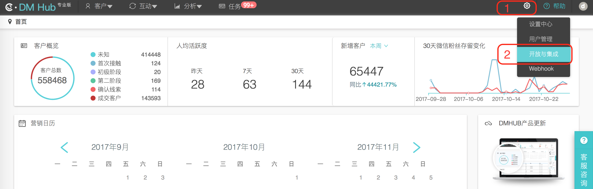
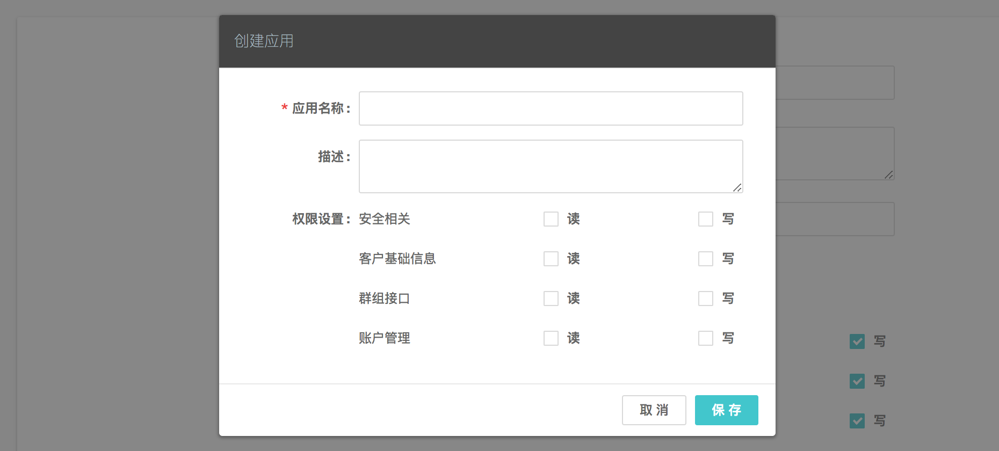

# iOS SDK 开发指南


# 目录

- [1. 使用说明](#1-使用说明)

- [2. 创建应用](#2-创建应用)
  - [2.1 进入应用设置页面](#21-进入应用设置页面)
  - [2.2 新建应用](#22-新建应用)

- [3. 导入 SDK](#3-导入-sdk)
  - [3.1 添加 SDK 文件](#31-添加-sdk-文件)
  - [3.2 添加系统库支持](#32-添加系统库支持)
  - [3.3 检查静态库文件路径](#33-检查静态库文件路径)
  - [3.4 引入头文件](#34-引入头文件)

- [4. 初始化](#4-初始化)

- [5. 设置客户身份](#5-设置客户身份)

- [6. 跟踪客户事件](#6-跟踪客户事件)
  - [6.1 跟踪客户自定义事件](#61-跟踪客户自定义事件)
  - [6.2 跟踪进入、离开视图事件](#62-跟踪进入离开视图事件)
  - [6.3 跟踪通知推送相关事件](#63-跟踪通知推送相关事件)
     - [6.3.1 跟踪 JPush 推送相关事件](#631-跟踪-jpush-推送相关事件)
     - [6.3.2 跟踪 GeTui 推送相关事件](#632-跟踪-getui-推送相关事件)


## 1. 使用说明

- 本文是 DMHub iOS SDK 标准的开发指南文档，用以指导 SDK 的集成和使用，默认读者已经具备一定的 iOS 开发能力。
- 本篇指南匹配的 DMHub iOS SDK 版本为： `v1.1.1` 。
- DMHub iOS SDK 0.1.1 要求  `iOS >= 7.0` 。

## 2. 创建应用

集成 DMHub SDK 之前，您首先需要到 DM Hub 平台创建应用。

### 2.1 进入应用设置页面

点击 DM Hub 平台首页右上角的齿轮图标，选择 `开放与集成` 选项，进入应用设置页面。



### 2.2 新建应用

在应用设置页面点击右上角的 `+ 新建` 按钮，在弹出的创建应用弹出框中填写应用信息后保存。应用创建成功之后，即可获得集成 SDK 所需的 appid。



## 3. 导入 SDK

### 3.1 添加 SDK 文件

在 Xcode 中选择 `File` ---> `Add Files to “YOUR_PROJECT_NAME”...` ，将 [libs 目录](libs) 下的 DMHubSDK.h 头文件和 dmhubsdk-ios-x.x.x.a 静态库文件添加到工程目录中。

### 3.2 添加系统库支持

在 `TARGETS` ---> `General` ---> `Linked Frameworks and Libraries` 下，添加以下系统库支持：

```tex
UIKit.framework
Foundation.framework
SystemConfiguration.framework
libsqlite3.tbd
```

### 3.3 检查静态库文件路径

检查 `TARGETS` ---> `Build Settings` ---> `Search Paths` 下的 `Library Search Paths` 。一般情况下，添加 dmhubsdk-ios-x.x.x.a 静态库文件时，Xcode 会自动在 `Library Search Paths` 中添加 `$(PROJECT_DIR)/{静态库文件所在相对目录}` ，如果没有，请手动添加。

### 3.4 引入头文件

在需要使用 DMHubSDK 功能的文件中引入头文件：

```objectivec
#import "DMHubSDK.h"
```

## 4. 初始化

使用 SDK 记录事件之前需要先进行初始化，在整个应用程序全局，只需要进行一次初始化，SDK 会在初始化时记录打开 App 事件。

- 接口定义

```objectivec
/**
 启动 SDK

 @param appId 在 DM Hub 平台创建应用时获得的 appid
 */
+ (void)startWithAppId:(NSString *_Nonnull)appId;

/**
 启动 SDK，并设置运行环境

 @param appId 在 DM Hub 平台创建应用时获得的 appid
 @param prod 是否在生产环境上运行，如果传入 NO，则在验证环境运行
 */
+ (void)startWithAppId:(NSString *_Nonnull)appId
                inProd:(BOOL)prod;
```

- 代码示例

在 `AppDelegate.m` 文件中的 `- (BOOL)application:(UIApplication *)application didFinishLaunchingWithOptions:(NSDictionary *)launchOptions` 方法中进行初始化：

```objectivec
- (BOOL)application:(UIApplication *)application didFinishLaunchingWithOptions:(NSDictionary *)launchOptions {

    // 初始化 DMHubSDK
    [DMHubSDK startWithAppId:@"<在 DM Hub 平台获得的 appid>"];

    return YES;
}
```

## 5. 设置客户身份

为了将客户事件绑定到客户身上，需要在 App 获取到客户身份信息时，设置客户身份。匿名事件会保存 30 天。

- 接口定义

```objectivec
/**
 设置客户身份，用于绑定事件。如果重复设置，将会使用新的客户身份进行事件绑定

 @param type 身份类型
 @param value 身份标识
 */
+ (void)setIdentityWithType:(NSString *_Nonnull)type
                      value:(NSString *_Nonnull)value;
```

## 6. 跟踪客户事件

### 6.1 跟踪客户自定义事件

根据业务需求在 DM Hub 后台 [新建自定义事件](../EVENT_GUIDE.md) 后，可以调用该 API 对自定义客户事件进行跟踪。在新建自定义事件时，还可以根据需要添加自定义属性，并在调用 API 时作为参数传入。

- 接口定义

```objectivec
/**
 跟踪自定义客户事件

 @param eventId 与 DM Hub 中新建的自定义事件对应的事件 Id
 @param properties 事件的自定义属性，必须以在 DM Hub 中新建自定义事件时添加的自定义属性作为 key
 */
+ (void)trackWithEventId:(NSString *_Nonnull)eventId
              properties:(Properties _Nullable)properties;
```

- 代码示例

```objectivec
- (BOOL)application:(UIApplication *)application didFinishLaunchingWithOptions:(NSDictionary *)launchOptions {

    // 初始化 DMHubSDK
    [DMHubSDK startWithAppId:@"<在 DM Hub 平台获得的 appid>"];

    // 跟踪首次打开 App 事件示例
    if (<首次打开 App>) {
        NSMutableDictionary<NSString *, NSString *> *properties = [NSMutableDictionary dictionary];
        [properties setValue:@"<首次打开 App 事件对应的自定义属性值>" forKey:@"<自定义属性名称>"];
        [DMHubSDK trackWithEventId:@"<eventId>" properties:properties];
    }

    return YES;
}
```

### 6.2 跟踪进入、离开视图事件

- 接口定义

```objectivec
/**
 跟踪进入视图事件

 @param viewName 视图的名称
 */
+ (void)trackOpenView:(NSString *_Nonnull)viewName;

/**
 跟踪离开视图事件

 @param viewName 视图的名称
 */
+ (void)trackExitView:(NSString *_Nonnull)viewName;
```

- 代码示例

```objectivec
@implementation YourViewController

- (void)viewWillAppear:(BOOL)animated {
    [super viewWillAppear:animated];
    
    // 跟踪进入视图事件
    [DMHubSDK trackOpenView:@"<viewName>"];
}

- (void)viewWillDisappear:(BOOL)animated {
    [super viewWillDisappear:animated];
    
    // 跟踪离开视图事件
    [DMHubSDK trackExitView:@"<viewName>"];
}

@end
```

### 6.3 跟踪通知推送相关事件

如果您使用了 DM Hub 平台提供的通知推送功能，则可以调用 SDK 提供的相关 API 对来自 DM Hub 平台的通知推送相关事件进行跟踪。

#### 6.3.1 跟踪 JPush 推送相关事件

- 接口定义

```objectivec
/**
 跟踪收到 JPush 通知事件

 @param userInfo JPush 通知中的 userInfo
 @param jPushAppKey JPush 的 AppKey
 @return 如果传入的 userInfo 对应的 JPush 通知来自 DM Hub 平台，返回 YES；否则，返回 NO
 */
+ (BOOL)trackReceiveJPushNoti:(NSDictionary *_Nonnull)userInfo
                  jPushAppKey:(NSString *_Nonnull)jPushAppKey;

/**
 跟踪点击 JPush 通知事件

 @param userInfo JPush 通知中的 userInfo
 @param jPushAppKey JPush 的 AppKey
 @return 如果传入的 userInfo 对应的 JPush 通知来自 DM Hub 平台，返回 YES；否则，返回 NO
 */
+ (BOOL)trackClickJPushNoti:(NSDictionary *_Nonnull)userInfo
                jPushAppKey:(NSString *_Nonnull)jPushAppKey;

/**
 跟踪收到 JPush 自定义消息事件

 @param notification JPush 收到自定义消息的回调方法中传入的 notification
 @param jPushAppKey JPush 的 AppKey
 @return 如果传入的 notification 对应的 JPush 自定义消息来自 DM Hub 平台，返回 YES；否则，返回 NO
 */
+ (BOOL)trackReceiveJPushMessage:(NSNotification *_Nonnull)notification
                     jPushAppKey:(NSString *_Nonnull)jPushAppKey;
```

- 代码示例

```objectivec
- (void)application:(UIApplication *)application didReceiveRemoteNotification:(NSDictionary *)userInfo fetchCompletionHandler:(void (^)(UIBackgroundFetchResult))completionHandler {
    // 跟踪收到 JPush 通知事件
    [DMHubSDK trackReceiveJPushNoti:userInfo jPushAppKey:JPUSH_APP_KEY];
}

- (void)application:(UIApplication *)application didReceiveRemoteNotification:(NSDictionary *)userInfo {
    // 跟踪收到 JPush 通知事件
    [DMHubSDK trackReceiveJPushNoti:userInfo jPushAppKey:JPUSH_APP_KEY];
}

#ifdef NSFoundationVersionNumber_iOS_9_x_Max
#pragma mark - JPUSHRegisterDelegate
- (void)jpushNotificationCenter:(UNUserNotificationCenter *)center willPresentNotification:(UNNotification *)notification withCompletionHandler:(void (^)(NSInteger))completionHandler {
    NSDictionary *userInfo = notification.request.content.userInfo;
    // 跟踪收到 JPush 通知事件
    [DMHubSDK trackReceiveJPushNoti:userInfo jPushAppKey:JPUSH_APP_KEY];
}

- (void)jpushNotificationCenter:(UNUserNotificationCenter *)center didReceiveNotificationResponse:(UNNotificationResponse *)response withCompletionHandler:(void (^)())completionHandler {
    NSDictionary *userInfo = response.notification.request.content.userInfo;
    // 跟踪点击 JPush 通知事件
    [DMHubSDK trackClickJPushNoti:userInfo jPushAppKey:JPUSH_APP_KEY];
}
#endif

// 收到 JPush 自定义消息的回调
- (void)didReceiveJPushMessage:(NSNotification *)notification {
    [DMHubSDK trackReceiveJPushMessage:notification jPushAppKey:JPUSH_APP_KEY];
}
```

#### 6.3.2 跟踪 GeTui 推送相关事件

- 接口定义

```objectivec
/**
 跟踪收到 GeTui 通知事件

 @param userInfo GeTui 通知中的 userInfo
 @param geTuiAppKey GeTui 的 AppKey
 @return 如果传入的 userInfo 对应的 GeTui 通知来自 DM Hub 平台，返回 YES；否则，返回 NO
 */
+ (BOOL)trackReceiveGeTuiNoti:(NSDictionary *_Nonnull)userInfo
                  geTuiAppKey:(NSString *_Nonnull)geTuiAppKey;

/**
 跟踪点击 GeTui 通知事件

 @param userInfo GeTui 通知中的 userInfo
 @param geTuiAppKey GeTui 的 AppKey
 @return 如果传入的 userInfo 对应的 GeTui 通知来自 DM Hub 平台，返回 YES；否则，返回 NO
 */
+ (BOOL)trackClickGeTuiNoti:(NSDictionary *_Nonnull)userInfo
                geTuiAppKey:(NSString *_Nonnull)geTuiAppKey;

/**
 跟踪收到 GeTui 透传消息事件

 @param payloadData GeTui 收到透传消息的回调方法中传入的 payloadData
 @param offLine GeTui 收到透传消息的回调方法中传入的 offLine
 @param geTuiAppKey GeTui 的 AppKey
 @return 如果传入的 payloadData 对应的 GeTui 透传消息来自 DM Hub 平台，返回 YES；否则，返回 NO
 */
+ (BOOL)trackReceiveGeTuiPayloadData:(NSData *_Nonnull)payloadData
                             offLine:(BOOL)offLine
                         geTuiAppKey:(NSString *_Nonnull)geTuiAppKey;
```

- 代码示例

```objectivec
- (void)application:(UIApplication *)application didReceiveRemoteNotification:(NSDictionary *)userInfo fetchCompletionHandler:(void (^)(UIBackgroundFetchResult))completionHandler {
    // 跟踪收到 GeTui 通知事件
    [DMHubSDK trackReceiveGeTuiNoti:userInfo geTuiAppKey:GETUI_APP_KEY];
}

- (void)application:(UIApplication *)application didReceiveRemoteNotification:(NSDictionary *)userInfo {
    // 跟踪收到 GeTui 通知事件
    [DMHubSDK trackReceiveGeTuiNoti:userInfo geTuiAppKey:GETUI_APP_KEY];
}

#if __IPHONE_OS_VERSION_MAX_ALLOWED >= __IPHONE_10_0
- (void)userNotificationCenter:(UNUserNotificationCenter *)center willPresentNotification:(UNNotification *)notification withCompletionHandler:(void (^)(UNNotificationPresentationOptions))completionHandler {
    NSDictionary *userInfo = notification.request.content.userInfo;
    // 跟踪收到 GeTui 通知事件
    [DMHubSDK trackReceiveGeTuiNoti:userInfo geTuiAppKey:GETUI_APP_KEY];
}

- (void)userNotificationCenter:(UNUserNotificationCenter *)center didReceiveNotificationResponse:(UNNotificationResponse *)response withCompletionHandler:(void (^)())completionHandler {
    NSDictionary *userInfo = response.notification.request.content.userInfo;
    // 跟踪点击 GeTui 通知事件
    [DMHubSDK trackClickGeTuiNoti:userInfo geTuiAppKey:GETUI_APP_KEY];
}
#endif

// 收到 GeTui 透传消息的回调
- (void)GeTuiSdkDidReceivePayloadData:(NSData *)payloadData andTaskId:(NSString *)taskId andMsgId:(NSString *)msgId andOffLine:(BOOL)offLine fromGtAppId:(NSString *)appId {
    [DMHubSDK trackReceiveGeTuiPayloadData:payloadData offLine:offLine geTuiAppKey:GETUI_APP_KEY];
}
```
